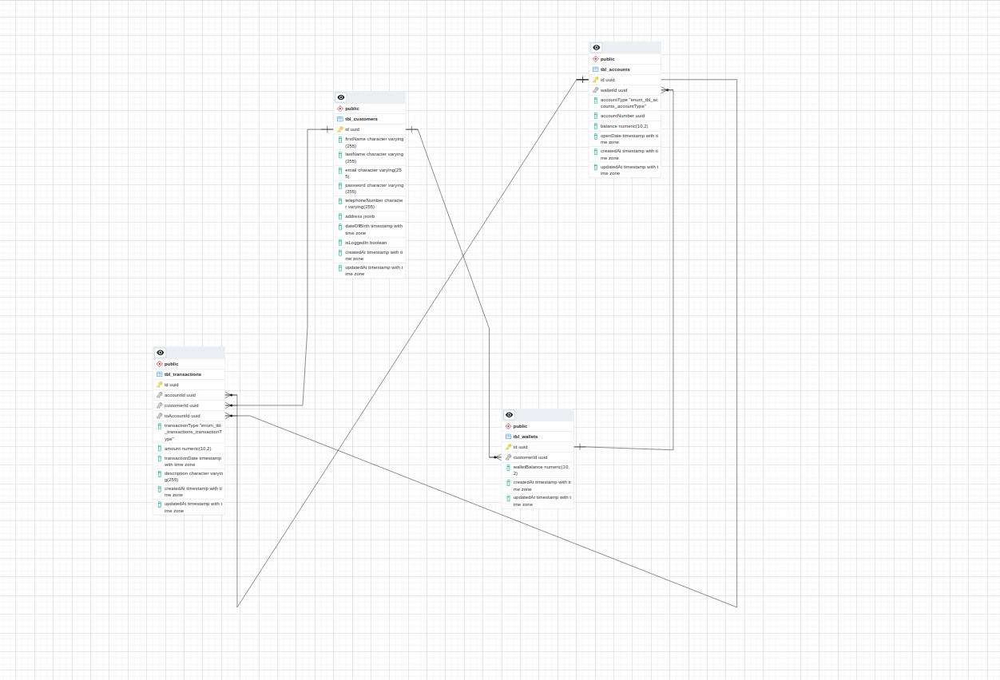

# Tekana-eWallet Backend Revamp

## Introduction
This project aims to rebuild the back-end solution for the legacy Tekana-eWallet application, serving over 1 million customers worldwide. This README provides an overview of the strategy, technology stack, code source, and features implemented in the revamped back-end system.

## Implented Deployment Architecture


## Strategy
My strategy for development Tekana-e-Wallet encompasses the following steps:
- **Project Initiation:**  I put myself in cross-functional teams position like:
    - including Business, 
    - UI/UX, 
    - front-end, and 
    - product owners.
- **Technology Stack:**
    - `Node js` Engine
    - `Express/Typescrity` Framework
    - `PostgresSQL` Database
    - `Sequelize` ORM
    - `Docker` for Containilization 
- **Development Process:** 
    - `Modularity` My Codes are grouped in well structured folders.
    - `Coding Standards` Are in place
    - `Clear Function and Class Definitions` I used standard to name classes and functions with appropriet naming convention.
    - `Documentation` All my endpoints are documented using swagger ui
- **Testing and Quality Assurance:** 
    - My code are setted up to be tested using Jest framework
- **Deployment:**
    - `Onrender` Render is a unified cloud to build and run all your apps

## Code Source
The back-end source code for Tekana-eWallet is hosted on https://github.com/Nkbtemmy/tekana-e-wallet. Below are key features that showcase the code design and functionality:

## Features
- **Customer Registration:** Enables customers to register and  login in the e-wallet system.
- **Wallet Creation:** Supports the creation of wallets for registered customers.
- **Customer Details:** Provides the ability to read customer details.
- **Transaction Management:** Facilitates creating and reading transactions.

## Database Design
The database design is optimized for high performance with considerations for indexing, normalization, partitioning, and data types. And i choose to use PostgresSQL database because of its benefits over other SQL databases.

## API Documentation and Design
APIs are well-documented and designed with best practices, including clear naming conventions, proper HTTP methods, error handling, versioning, and security measures. https://tekana-e-wallet.onrender.com/api-docs/

## Creativity and Innovation
I have incorporated innovative solutions and out-of-the-box thinking to address unique challenges in the e-wallet domain.
 * I Did also implement auto scaling using node js feature of utilizing server's processorsso that we will have more than one application instance running on server.

## Running the Code
The code is ready to run with minimal configuration. To get started, follow these steps:
1. Clone the repository.
2. Enter in repository folder
3. Install dependencies by using `yarn install` or `npm install` in your terminal
4. Configure your developmet environment by creating `.env` file and copy paste from `.env.example`.
5. Make sure you have created  postgres database so that you could use  correct credentials.
6. First run `yarn db:migration` or `npm run db:migration`.
6. Run the application with the scripts specified on next line.

 ``` Good way to test this application with less requirements is to run * make start * while docker is up and running, because it will use images from docker compose and takes the tester shorter time to run without additional installations```
## Runnable Scripts
- `dev`: Runs the project in development mode with automatic server restarts on file changes using nodemon.
- `ts:dev`: Runs TypeScript code in development with automatic restarts, directory watching, and specifying the entry file using ts-node-dev.
- `start`: Starts the application in production mode by executing the compiled JavaScript code.
- `build`: Compiles TypeScript code into JavaScript using the TypeScript compiler (tsc).
- `clean`: Removes the build directory or any build artifacts using rimraf.
- `prebuild`: Cleans up existing build artifacts before starting the build process.
- `format`: Automatically formats the code using Prettier.
- `test`: Runs unit tests with Jest, specifying the port, using a Jest configuration file, and including options for open handle detection and forced exit.
- `test:coverage`: Runs unit tests with Jest and generates code coverage reports.
- `db:migrate`: Executes database migrations using Sequelize.
- `db:seed`: Seeds the database with initial data using Sequelize.
- `db:unseed`: Unseeds the database by undoing all previously seeded data using Sequelize.
- `db:migrate:undo`: Undoes all previous database migrations using Sequelize.
- `db:reset`: Resets the database by undoing migrations, reapplying migrations, and seeding using npm scripts.
- `db:hard:reset`: Performs a comprehensive database reset, including dropping, creating, migrating, and seeding the database using npm scripts.
- `db:create`: Creates the database using Sequelize.
- `db:make:migration`: Generates a new migration file using Sequelize with the specified name.
- `db:drop`: Drops the database using Sequelize.

## Submission
The source code is available on https://github.com/Nkbtemmy/tekana-e-walletas public repository and will be accessible to anyone want to.

## Entity Relationship Diagram(ERD)


